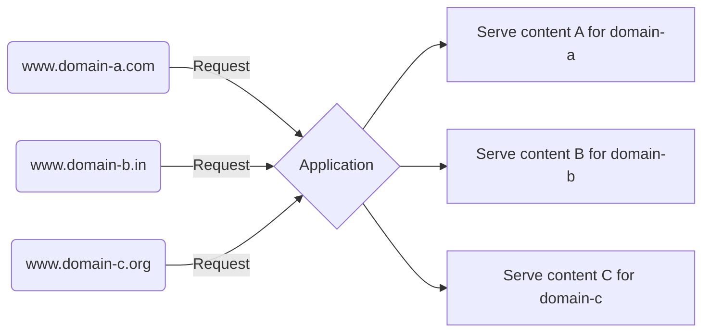

# multidomain-handling-react-app
Objectives - Create an application which can handle multiple domain based routing in reactjs.

```mermaid

flowchart LR

A(www.domain-a.com) --> |Request| D{Application}
B(www.domain-b.in) --> |Request| D{Application}
C(www.domain-c.org) --> |Request| D{Application}

D{Application} --> E[Serve content A for domain-a]
D{Application} --> F[Serve content B for domain-b]
D{Application} --> G[Serve content C for domain-c]

```